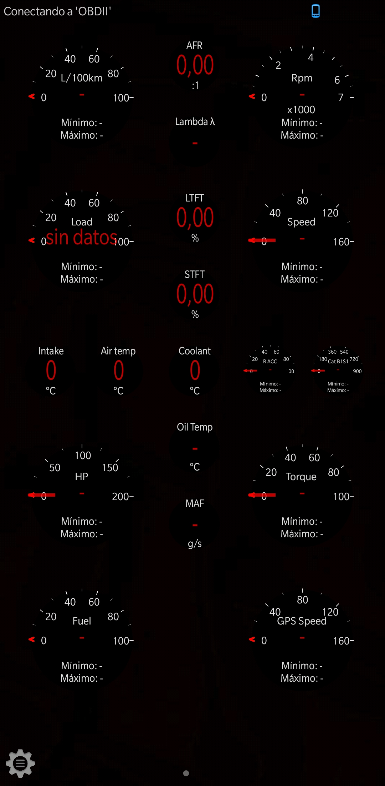
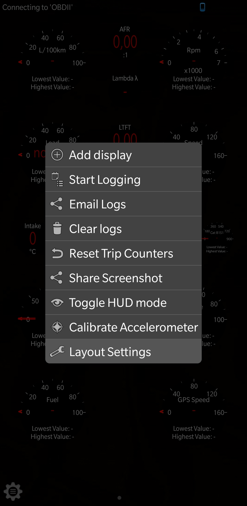
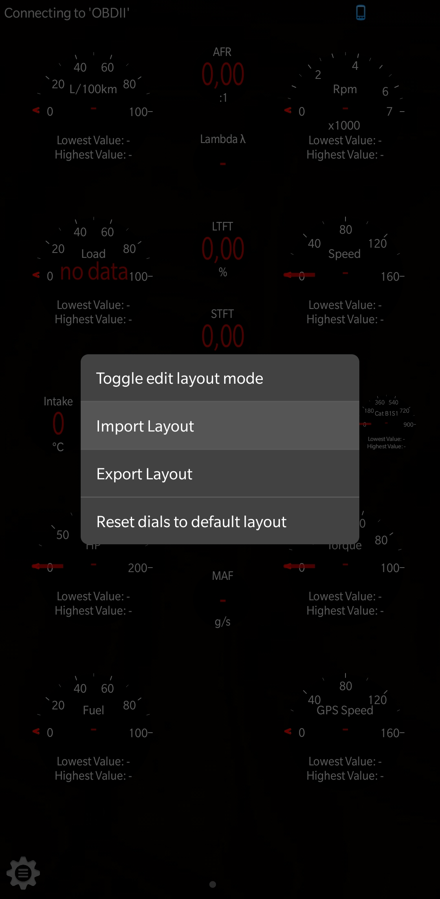
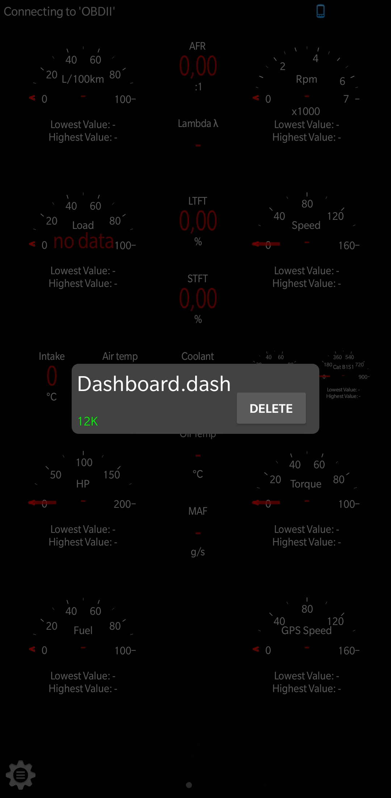
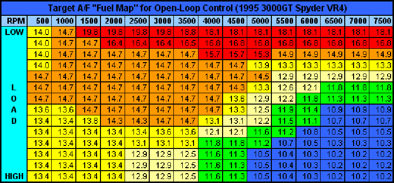

 

# Dashboard for App Torque

	

## Installing dashboard
- Download App Torque Pro from [Google Play](https://play.google.com/store/apps/details?id=org.prowl.torque)
- Download Dashboard.dash file
- Copy file .dash to root memory Android Phone, path /memory internal/.torque/dashboards/
- Open App Torque, Realtime Information / Settings / Layout settings / Import layout

 

## Description
- **AFR** = Shows the fuel and air mixture, should give a value 14.7
- **Lambda λ** = Lambda factor, the value should be 1.0%
- **LTFT (Long Term Fuel Trim)** = Actually it is an adjustment due to the calculated wear of the injector over time. Simply to compensate for aging. Normal value ± 10%.
- **STFT (Short Term Fuel Trim)** = Short term fuel adjustment, The final value of Fuel trim is the sum of both values, and can be a positive value (adds fuel) or a negative value (subtracts fuel).

        

